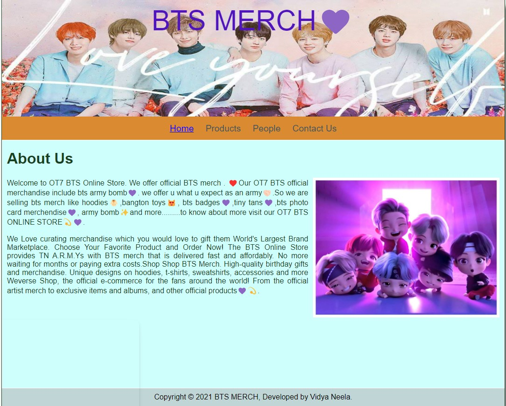

# Web Design for a Software Product Company

## AIM:

To design a static website for a software product company company.

## DESIGN STEPS:

### Step 1:

Requirement collection.

### Step 2:

Creating the layout using HTML and CSS.

### Step 3:

Updating the sample content.

### Step 4:

Choose the appropriate style and color scheme.

### Step 5:

Validate the layout in various browsers.

### Step 6:

Validate the HTML code.

### Step 6:

Publish the website in the given URL.

## PROGRAM :

##HOME
```
<!DOCTYPE html>
<html lang="en">
  <head>
    <title>OT7 BTS ONLINE STORE</title>
    <link rel="stylesheet" href="./css/layout.css" />
    <link rel="icon" href="./img/icon1.jpg" type="image/x-icon" />
  </head>

  <body>
    <div class="container">
      <div class="banner">BTS MERCH💜</div>
      <div class="menu">
        <div class="menuitemselected"><a href="/static/home.html">Home</a></div>
        <div class="menuitem"><a href="/static/products.html">Products</a></div>
        <div class="menuitem"><a>People</a></div>
        <div class="menuitem"><a>Contact Us</a></div>
      </div>
      <div class="content">
        <div class="homecontent">
          <h1>About Us</h1>
          
          <div class="contenttext">
            Welcome to OT7 BTS  Online Store. We offer official BTS merch .
            ❤️Our OT7 BTS official merchandise include bts army bomb💜.
            we offer you what you expect as an army🤝🏻.So we are selling bts merch like hoodies🧥,bangton toys😻,
            bts badges💜,tiny tans💜,bts photo card merchendise💜,
            army bomb✨and more.........to know about more visit our OT7 BTS ONLINE STORE💫💜.
            <br />
            <br/>
            We Love curating merchandise which you would love to gift them World's Largest Brand Marketplace.
             Choose Your Favorite Product and Order Now! The BTS Online Store provides TN A.R.M.Ys with BTS merch 
             that is delivered fast and affordably. No more waiting for months or paying extra costs.Shop
              Shop BTS Merch. High-quality birthday gifts and merchandise. Unique designs on hoodies, t-shirts, sweatshirts, accessories and more
              Weverse Shop, the official e-commerce for the fans around the world! From the official artist merch 
              to exclusive items and albums, and other official products💜💫.
          </div>
        </div>
      </div>
      <div class="footer">
        Copyright &#169; 2021 BTS MERCH, Developed by Vidya Neela.
      </div>
    </div>
  </body>
</html>
```
##PRODUCT:
```
<!DOCTYPE html>
<html lang="en">
  <head>
    <title>Bts products</title>
    <link rel="stylesheet" href="./css/layout.css" />
    <link rel="icon" href="./img/icon1.jpg" type="image/x-icon" />
  </head>

  <body>
    <div class="container">
      <div class="banner">BTS MERCH</div>
      <div class="menu">
        <div class="menuitem"><a href="/static/home.html">Home</a></div>
        <div class="menuitemselected">
          <a href="/static/products.html">Products</a>
        </div>
        <div class="menuitem"><a>People</a></div>
        <div class="menuitem"><a>Contact Us</a></div>
      </div>
      <div class="content">
        <div class="productcontent">    
          <h1>Our Premium Products</h1>
          <div class="productitems">
              <div class="productitem"> 
                  <div class="itemimage">
                  
                  </div>
                  <div class="itemname">Bangton Toy</div>
                  <div class="itemprice">Price: Rs.8,000.00 </div>
              </div>
              <div class="productitem"> 
                  <div class="itemimage">
                  
                  </div>
                  <div class="itemname">Bts Hoodie</div>
                  <div class="itemprice">Price: Rs.5,000.00 </div>
              </div>
              <div class="productitem"> 
                <div class="itemimage">
                
                </div>
                <div class="itemname">ARMY BOMB</div>
                <div class="itemprice">Price: Rs.2,000.00 </div>
            </div>
            <div class="productitem"> 
              <div class="itemimage">
              
              </div>
              <div class="itemname">BTS TINY BAGS</div>
              <div class="itemprice">Price: Rs.1,000.00 </div>
            </div>
            <div class="productitem"> 
               <div class="itemimage">
               
             </div>
               <div class="itemname">BTS PHONE POP</div>
               <div class="itemprice">Price: Rs.700.00 </div>
              </div>
               <div class="productitem"> 
                 <div class="itemimage">
                
               </div>
                <div class="itemname">BTS POP SOCKETS</div>
                 <div class="itemprice">Price: Rs.500.00 </div>
                </div>
                  <div class="productitem"> 
                   <div class="itemimage">
                  
                 </div>
                  <div class="itemname">BTS OT7 PHONE CASE</div>
                  <div class="itemprice">Price: Rs.1,400.00 </div>
                </div>
                  <div class="productitem"> 
                    <div class="itemimage">
                    
                    </div>
                    <div class="itemname">RM PHONE CASE</div>
                    <div class="itemprice">Price: Rs.250.00 </div>
                 </div>
                    <div class="productitem"> 
                      <div class="itemimage">
                      
                    </div>
                      <div class="itemname">KOOKIE PHONE CASE</div>
                      <div class="itemprice">Price: Rs.250 </div>
                   </div>
                     <div class="productitem"> 
                      <div class="itemimage">
                      
                    </div>
                      <div class="itemname">JIN PHONE CASE</div>
                      <div class="itemprice">Price: Rs.250.00 </div>
                    </div>
                    <div class="productitem"> 
                      <div class="itemimage">
                      
                      </div>
                      <div class="itemname">SUGA PHPONE CASE</div>
                      <div class="itemprice">Price: Rs.250.00 </div>
                  </div>
                  <div class="productitem"> 
                    <div class="itemimage">
                    
                    </div>
                    <div class="itemname">V PHONE CASE</div>
                    <div class="itemprice">Price: Rs.250.00 </div>
                </div>
                <div class="productitem"> 
                  <div class="itemimage">
                  
                  </div>
                  <div class="itemname">Bts Hoodie</div>
                  <div class="itemprice">Price: Rs.250.00 </div>
              </div>
          </div>
          </div>        
      </div>
      <div class="footer">
        Copyright &#169; 2021 BTS MERCH, Developed by Vidya Neela.
      </div>
    </div>
  </body>
</html>
```
##PEOPLE:
```
<!DOCTYPE html>
<html lang="en">
  <head>
    <title>Bts people</title>
    <link rel="stylesheet" href="./css/layout.css" />
    <link rel="icon" href="./img/icon1.jpg" type="image/x-icon" />
  </head>

  <body>
    <div class="container">
      <div class="banner">BTS MERCH</div>
      <div class="menu">
        <div class="menuitem"><a href="/static/home.html">Home</a></div>
        <div class="menuitemselected">
          <a href="/static/people.html">People</a>
        </div>
        <div class="menuitem"><a>Contact Us</a></div>
      </div>
      <div class="content">
        <div class="peoplecontent">    
          <h1>PEOPLE-OUR TEAM</h1>
          <div class="peopleitems">
              <div class="peopleitem"> 
                  <div class="peopleimage">
                  
                  </div>
                  <div class="itemname">KIM NAMJOON</div>
              </div>
              <div class="productitem"> 
                  <div class="itemimage">
                  
                  </div>
                  <div class="itemname">KIM SEOKJIN</div>
              </div>
              <div class="productitem"> 
                <div class="itemimage">
                
                </div>
                <div class="itemname">PARK JIMIN</div>
            </div>
            <div class="productitem"> 
              <div class="itemimage">
              
              </div>
              <div class="itemname">JUNK HOSEOK</div>
            </div>
            <div class="productitem"> 
               <div class="itemimage">
               
             </div>
               <div class="itemname">TEAHYUNG</div>
              </div>
               <div class="productitem"> 
                 <div class="itemimage">
                
               </div>
                <div class="itemname">JEON JUNG-KOOK</div>
                </div>
                  <div class="productitem"> 
                   <div class="itemimage">
                  
                 </div>
                  <div class="itemname">MIN YOONGI</div>
                </div>        
      </div>
      <div class="footer">
        Copyright &#169; 2021 BTS MERCH, Developed by Vidya Neela.
      </div>
    </div>
  </body>
</html>
```
##CONTACTUS:
```
<!DOCTYPE html>
<html lang="en">
  <head>
    <title>Hyde Solutions</title>
    <link rel="stylesheet" href="./css/layout.css" />
    <link rel="icon" href="./img/hydeicon.jpeg" type="image/x-icon" />
  </head>

  <body>
    <div class="container">
      <div class="topbg">Hyde Solutions</div>
      <div class="menu">
        <div class="menuitemselected"><a href="/static/home.html">Home</a></div>
        <div class="menuitemselected"><a href="/static/products.html">Products</a></div>
        <div class="menuitemselected"><a href="/static/people.html">People</a></div>
        <div class="menuitemselected"><a href="/static/Contact.html">Contact Us</a></div>
      </div>
      <div class="content">
            <div class="Contactcontent">    
                <h1>CONTACT US</h1>
                <div class="Contactitems">
                    <div class="Contactitem"> 
                        <h2>UAE</h2><br>
                        <div class="conadd">Unit No: 741, DMCC Business Centre Level No 1,<br>
                            Jewellery & Gemplex 3,<br>
                            Dubai United Arab Emirates<br>
                            <br>
                        <div class="connub">Mobile: +91 20 66813232</div><br>
                            <div class="conem">Email: info@btsot7store.com</div>
                            <h2>INDIA</h2><br>
                        <div class="conadd">PRODUCT TECHNOLOGIES LIMITED<br>
                            <br>
                            CIN - L72200MH1995PLC091408, Marvel Edge,<br>
                            Office No.7010 C & D, 7th Floor, Viman Nagar,<br>
                            Pune 411014, Maharashtra, India<br></div>
                            <br>
                            <div class="connum">Mobile: +91 20 66813232 </div><br>
                            <div class="conem">Email: info@btsot7store.com</div>
                            <h2>JAPAN</h2><br>
                        <div class="conadd">BTS OT7 STORE JAPAN KK.<br>
                            <br>
                            10 F, 5 Sankyou Building, Shinkawa 1-2-8,<br>
                            Chuo-ku,Tokyo 104-0033<br>
                            <br>
                        <div class="connub">Mobile:+81 3 6228 3983 (Phone: Support/Sales)</div><br>
                            <div class="conem">Email: info@btsot7store.com</div>
                        </div>
                    </div>        
                </div>
                <div class="footer">
                    Copyright &#169; 2021 BTS MERCH, Developed by Vidya Neela.
                  </div>
                </div>
              </body>
            </html>
```          


## OUTPUT:

### Home Page:



## Result:

Thus a website is designed for the software product company and the HTML,CSS code are validated.
